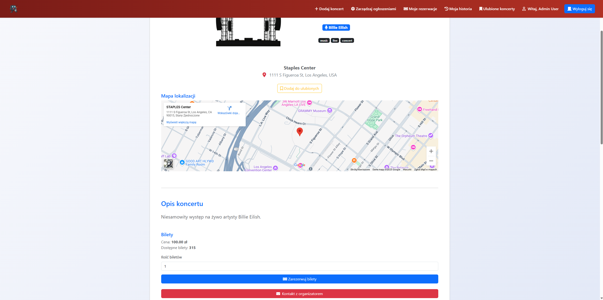
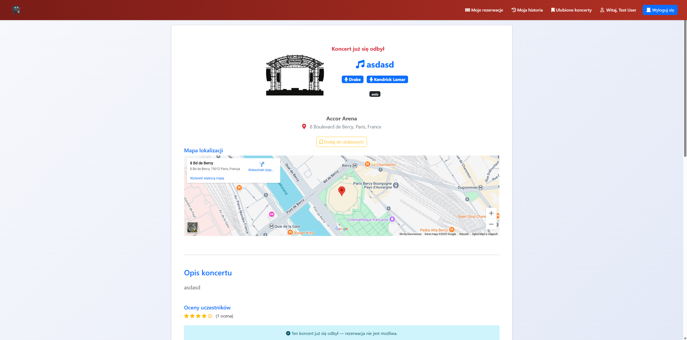

# System Rezerwacji Koncertów

Aplikacja webowa stworzona w Laravelu do zarządzania koncertami i rezerwacjami biletów. Projekt został zrealizowany w ramach studiów na kierunku **Programowanie Internetowych Aplikacji Biznesowych**.

## 🔧 Technologie:
- PHP 8.x
- Laravel 10
- MySQL
- Blade (szablony Laravel)
- Bootstrap 5
- Git

## 📌 Funkcje aplikacji:
- Rejestracja i logowanie użytkowników
- Panel administratora z zarządzaniem koncertami i artystami
- Obsługa ról użytkowników (admin / użytkownik)
- Walidacja danych (np. przyszła data koncertu, limit biletów)
- Soft delete koncertów i artystów
- System rezerwacji biletów z limitem dostępnych miejsc
- Logika biznesowa m.in. sprawdzanie dostępności koncertów
- Obsługa sesji i bezpieczeństwo (hashowanie haseł, CSRF)

## ▶️ Jak uruchomić:
```bash
git clone https://github.com/Example7/SystemRezerwacjiKoncertow.git
cd SystemRezerwacjiKoncertow
composer install
cp .env.example .env
php artisan key:generate
# W pliku .env ustaw dane dostępowe do bazy danych
php artisan migrate
php artisan serve
```

## 📷 Screenshoty:

### Panel administratora  


### Widok użytkownika  


## 👨‍💻 Autor:
**Kacper Kałużny ([Example7](https://github.com/Example7))**  
